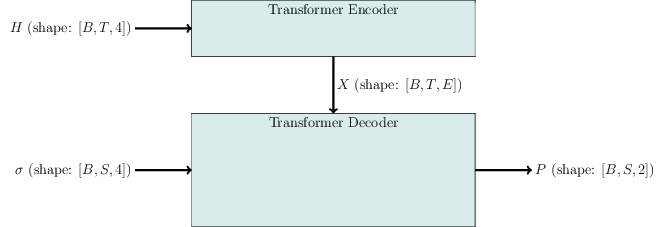

# RydbergGPT
A large language model (LLM) for Rydberg atom physics.

## Architecture

Vanilla transformer architecture taken from [Attention is All You Need](https://research.google/pubs/pub46201/).



## Installation

## Documentation

## References

```bib
@inproceedings{46201,
title   = {Attention is All You Need},
author  = {Ashish Vaswani and Noam Shazeer and Niki Parmar and Jakob Uszkoreit and Llion Jones and Aidan N. Gomez and Lukasz Kaiser and Illia Polosukhin},
year    = {2017},
URL = {https://arxiv.org/pdf/1706.03762.pdf}
}
```


