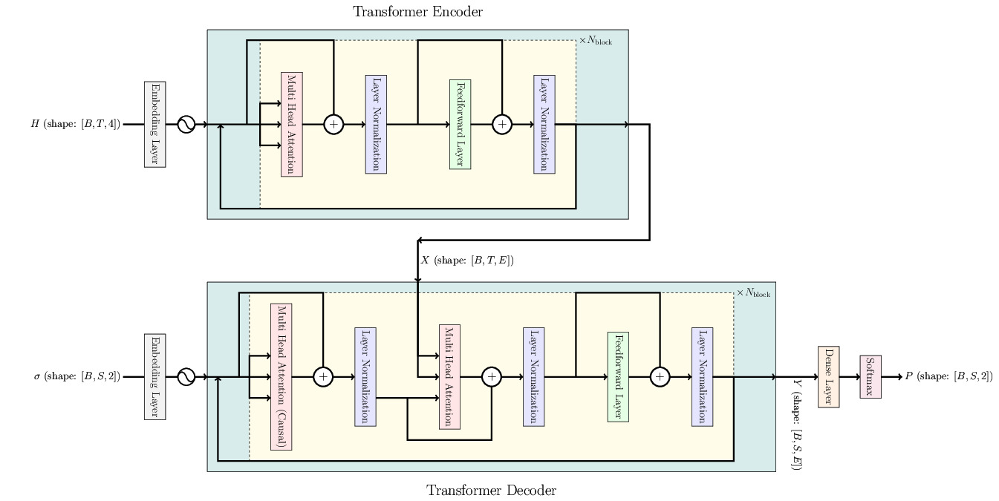

# Architecture 

## Rydberg System
$$
\hat{H}_{\mathrm{Rydberg}} = 
\sum_{i < j} \frac{C_6}{\lVert \mathbf{r}_i - \mathbf{r}_j \rVert} \hat{n}_i \hat{n}_j - \delta \sum_{i} \hat{n}_i - \frac{\Omega}{2} \sum_{i} \hat{\sigma}_i^{(x)},
$$

$$
C_6 = \Omega \left( \frac{R_b}{a} \right)^6, \quad V_{ij} = \frac{a^6}{\lVert \mathbf{r}_i - \mathbf{r}_j \rVert^6}
$$

- $V_{ij}$ = blockade interaction between atoms $i$ and $j$
- $a$ = Lattice spacing
- $R_b$ = Rydberg blockade radius
- $\mathbf{r}_i$ = the position of atom $i$
- $\hat{n}_i$ = number operator at ion $i$
- $\delta$ = detuning at atom $i$
- $\Omega$ = Rabi frequency at atom $i$

## Transformer

Vanilla transformer architecture taken from [Attention is All You Need](https://arxiv.org/pdf/1706.03762.pdf).

$$
H_i = \mathrm{GraphNN}(\mathrm{edges} = V_{ij} \ ; \mathrm{nodes}=\Omega_i, \Delta_i, R_b, \beta)
= \text{Hamiltonian parameters encoded in a sequence by a graph neural network,}
$$

$$
\sigma_i = \text{one-hot encoding of measured spin of qubit $i$}
$$

$$
P_i = P(\sigma_i | \sigma_{< i}) = \text{conditional probability distribution of spin $i$}
$$

$$
i = \text{sequence index (either $T$ or $S$ axis shown in the architecture diagram).}
$$

The transformer encoder represents the Rydberg Hamiltonian with a sequence.  
The transformer decoder represents the corresponding ground state wavefunction.