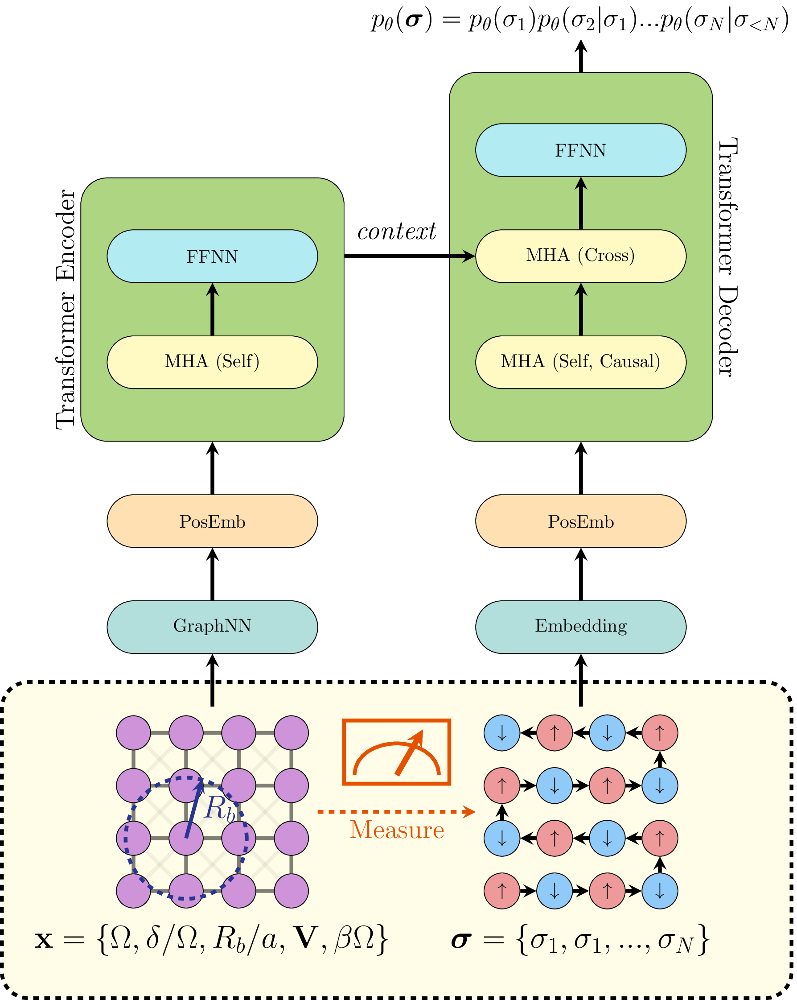

# RydbergGPT
A large language model (LLM) for Rydberg atom array physics. Manuscript available on [arXiv](https://arxiv.org/abs/2405.21052).

## Architecture 

## Rydberg System
$$
\hat{H}_{\mathrm{Rydberg}} = 
\sum_{i < j}^{N} \frac{C_6}{\lVert \mathbf{r}_i - \mathbf{r}_j \rVert} \hat{n}_i \hat{n}_j - \delta \sum_{i}^{N} \hat{n}_i - \frac{\Omega}{2} \sum_{i}^{N} \hat{\sigma}_i^{(x)},
$$

$$
C_6 = \Omega \left( \frac{R_b}{a} \right)^6, \quad V_{ij} = \frac{a^6}{\lVert \mathbf{r}_i - \mathbf{r}_j \rVert^6}
$$

- $N = L \times L =$ number of atoms/qubits
- $i, j =$ qubit index
- $V_{ij} =$ blockade interaction between qubits $i$ and $j$
- $a =$ Lattice spacing
- $R_b =$ Rydberg blockade radius
- $\mathbf{r}_i =$ the position of qubit $i$
- $\hat{n}_i =$ number operator at qubit $i$
- $\delta =$ detuning at qubit $i$
- $\Omega =$ Rabi frequency at qubit $i$
- $\beta =$ Inverse temperature of system

### Transformer

Vanilla transformer architecture taken from [Attention is All You Need](https://arxiv.org/pdf/1706.03762.pdf).



- $\mathbf{x} =$ experimental settings
- $\sigma_i =$ one-hot encoding of measured qubit $i$
- $p_{\theta}(\sigma_i | \sigma_{< i}) =$ neural network conditional probability distribution of qubit $i$


The transformer encoder represents the Rydberg Hamiltonian with a sequence. <br/>
The transformer decoder represents the corresponding ground state wavefunction.

## Acknowledgements

We sincerely thank the authors of the following very helpful codebases we used when building this repository :

- Transformer tutorials:
    - [Annotated Transformer](https://github.com/harvardnlp/annotated-transformer/)
    - [Illustrated Transformer](https://jalammar.github.io/illustrated-transformer/)
- Transformer quantum state:
    - [Predicting Properties of Quantum Systems with Conditional Generative Models](https://github.com/PennyLaneAI/generative-quantum-states)
    - [Transformer Quantum State](https://github.com/yuanhangzhang98/transformer_quantum_state)


## References

```bib
@inproceedings{46201,
title	= {Attention is All You Need},
author	= {Ashish Vaswani and Noam Shazeer and Niki Parmar and Jakob Uszkoreit and Llion Jones and Aidan N. Gomez and Lukasz Kaiser and Illia Polosukhin},
year	= {2017},
URL	= {https://arxiv.org/pdf/1706.03762.pdf}
}
```
